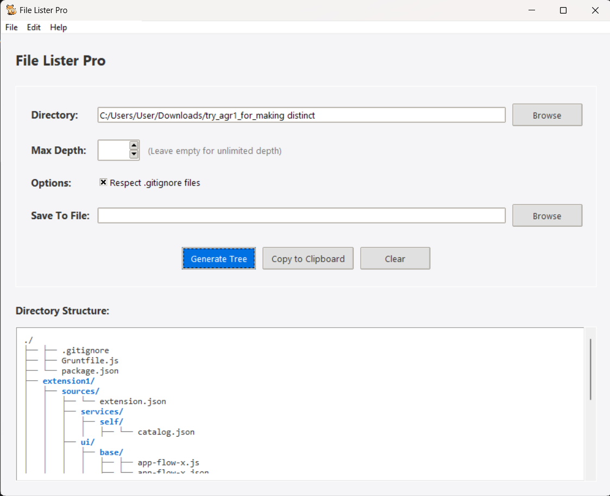

# File Lister Pro


A professional tool for generating directory tree structures with a modern, user-friendly interface.

## Features

- **Visual Directory Tree**: Generate a visual representation of your file system structure
- **Gitignore Support**: Automatically exclude files and directories listed in `.gitignore` files
- **Customizable Depth**: Control how deep the directory traversal goes
- **Export Options**: Save the generated tree to a text file or copy to clipboard
- **Syntax Highlighting**: Color-coded display of directories and files
- **Clean Modern UI**: Professional interface with intuitive controls

## Screenshot



## Installation

### Requirements

- Python 3.6 or higher
- Tkinter (usually comes bundled with Python)

### Steps

1. Clone this repository:
   ```
   git clone https://github.com/agnatio/file_lister.git
   ```
2. Navigate to the project directory:
   ```
   cd file_lister
   ```
3. Run the program:
   ```
   python file_lister.py
   ```

## Usage

1. **Select a Directory**: Click "Browse" or use File → Open Directory to select the folder you want to analyze
2. **Set Options**:
   - Max Depth: Limit how deep the script looks into subfolders (leave empty for unlimited)
   - Respect .gitignore: Check to automatically ignore files listed in .gitignore files
3. **Generate Tree**: Click the "Generate Tree" button or use File → Generate Tree
4. **Output Options**:
   - Copy to Clipboard: Copy the tree to your clipboard
   - Save to File: Specify a location to save the tree as a text file

## Keyboard Shortcuts

- **Ctrl+O**: Open Directory
- **Ctrl+S**: Save Output As
- **F5**: Generate Tree
- **Ctrl+C**: Copy to Clipboard
- **Ctrl+X**: Clear Output
- **F1**: Show About

## Configuration

The application automatically ignores common directories including:

- `.git`
- `venv`
- `__pycache__`
- `node_modules`

## Contributing

Contributions are welcome! Please feel free to submit a Pull Request.

1. Fork the repository
2. Create your feature branch (`git checkout -b feature/amazing-feature`)
3. Commit your changes (`git commit -m 'Add some amazing feature'`)
4. Push to the branch (`git push origin feature/amazing-feature`)
5. Open a Pull Request

## License

This project is licensed under the MIT License - see the LICENSE file for details.

## Acknowledgments

- Icon made by [Icon Author] from [Icon Source]
- Thanks to all contributors who have helped improve this tool

---

Made by Alexey Matveev
